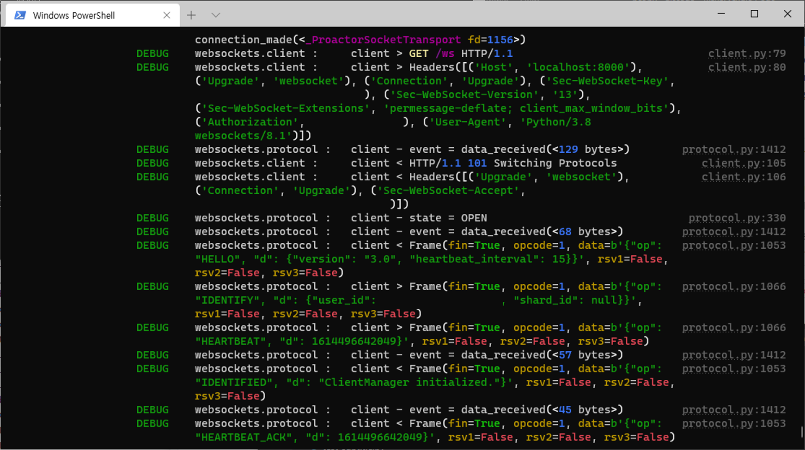

.. _logging_setup:

Setting Up Logging
==================

Basic logging
-------------

discodo_ logs several information via the logging_ python module like discord.py_. It is strongly recommended to configure the logging module, as you can't see some error if it is not set up. You can configure the logging_ module as simple as:

.. _discodo: https://github.com/kijk2869/discodo
.. _logging: https://docs.python.org/3/library/logging.html#module-logging
.. _discord.py: https://github.com/Rapptz/discord.py
.. _rich: https://github.com/willmcgugan/rich

.. code-block:: python3

    import logging

    logging.basicConfig(level=logging.INFO)

Placed at the start of the code. This will output the logs from all libraries which use the logging_ module, including discodo_, to the console.

The ``level`` argument specifies what level of events to log and can be any of ``CRITICAL``, ``ERROR``, ``WARNING``, ``INFO``, and ``DEBUG`` and default value is ``WARNING``

For more information, check the documentation of the logging_ module.

Use rich formatter
-------------------

Also, discodo_ uses rich_ to improve log readability. rich_ is an library for rich text and formatting in the terminal. To output the log to the terminal using rich_, you can set it as follows:

.. code-block:: python3

    import logging
    from rich.logging import RichHandler

    logging.basicConfig(level=logging.INFO, format="%(name)s :\t%(message)s", handlers=[RichHandler(rich_tracebacks=True)])

Because rich_ displays the ``log level`` separately, remove the ``level`` from the ``format`` argument, and set ``rich_tracebacks`` to ``True`` for formatting tracebacks.

When you set this, the log will be formatted as follows:

